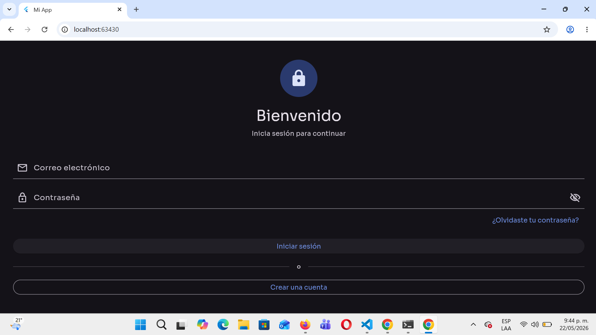
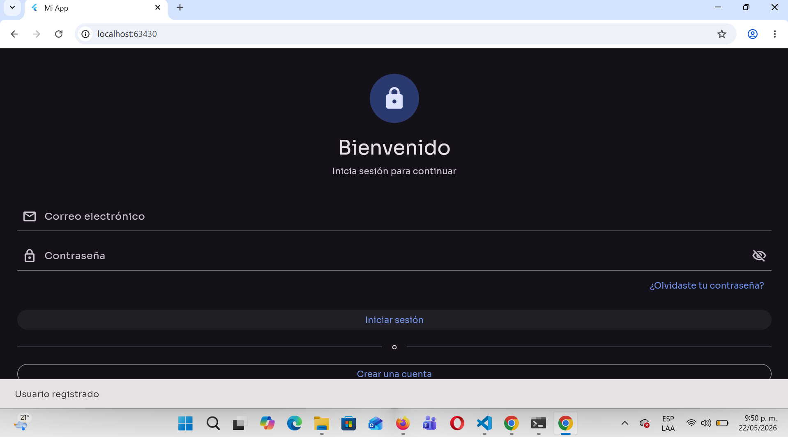
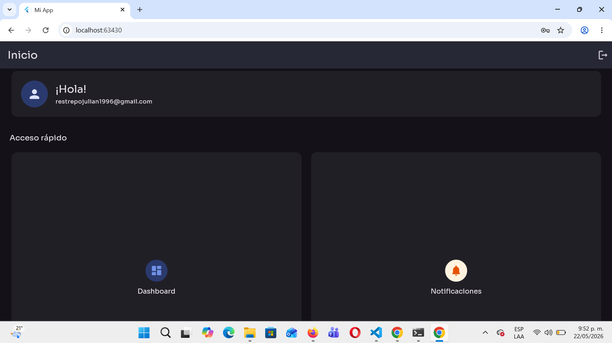

# Actividad 2 - Navegación y Login en Flutter

## Descripción

Aplicación desarrollada en Flutter que permite:

- Registro de usuarios.
- Inicio de sesión.
- Validación de contraseñas.
- Navegación entre pantallas.
- Almacenamiento local de datos mediante SharedPreferences.

## Pantallas

### Login



### Registro



### Home



## Funcionalidades

- Pantalla de Login.
- Pantalla de Registro.
- Validación de contraseñas coincidentes.
- Guardado local de usuarios.
- Inicio de sesión funcional.
- Navegación hacia Home después del login.

## Tecnologías Utilizadas

- Flutter
- Dart
- SharedPreferences

## Ejecución

```bash
#flutter pub get
#flutter run
```

## Autor

Julian Restrepo